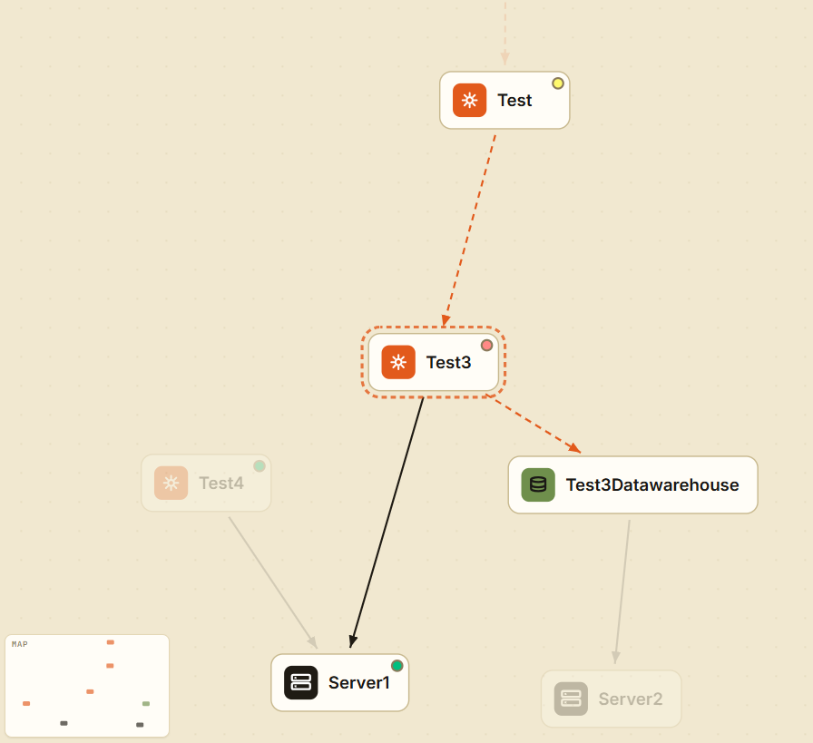

# ServiceCatalog

A simple self-hosted service catalog that maps your infrastructure as a dependency graph. Track services, servers, and databases, model how they relate to each other, and monitor their availability in real time.



---

## Features

### Dependency Graph
- **Graph view** — interactive force-directed canvas with pan, zoom, drag, and minimap. Nodes are laid out hierarchically (services at top, servers at bottom) so edges never cross nodes on first load.
- **Grid view** — card-based overview grouped by node type, sortable and filterable.
- **Two relation types** — `RUNS_ON` (solid arrow, orange) links a service or database to the server it runs on; `REQUIRES` (dashed arrow, blue) links a service to its dependencies.
- **Contextual highlighting** — clicking a node dims everything outside its 1-hop neighbourhood.

### Node Types & Properties

| Type | Type-specific fields |
|---|---|
| **Service** | Address (clickable link), Code Repository (clickable link), Documentation URL (clickable link) |
| **Server** | Operating System (Windows / Linux) |
| **Database** | Database type |

All nodes share: Name, Owner, Address, Description.

### Inline Editing
Every field in the Inspector panel is editable in place — no modal required. URL fields show an external-link button as soon as a value is entered.

### Health Monitoring
- **HTTP GET checks** for services and databases
- **ICMP Ping checks** for servers (requires `NET_RAW` capability in Docker)
- Per-node configuration: check interval (15 s – 15 min) and retry count
- **Live status stream** via Server-Sent Events — no polling, no page refresh
- **Three display states**:
  - 🟢 **Available** — check passes
  - 🟡 **Compromised** — check passes but a transitive dependency is unavailable (propagated via reverse BFS through the entire dependency chain)
  - 🔴 **Unavailable** — check fails after retries

Status dots appear on graph nodes, grid cards, the sidebar list, and the Inspector monitor tab.

### Search & Filter
- Full-text search across name, description, and owner fields
- Type filter chips (Service / Server / Database) with live counts
- Sidebar node directory stays in sync with the active view

---

## Tech Stack

| Layer | Technology |
|---|---|
| Database | Neo4j 5 (graph database) |
| Backend | ASP.NET Core 10 (Minimal API) |
| Frontend | Vue 3 + TypeScript + Vite |
| State | Pinia |
| Styling | CSS custom properties (dark / light theme ready) |
| Container | Docker Compose |

---

## Getting Started

### Prerequisites
- [Docker](https://docs.docker.com/get-docker/) and Docker Compose

### Run

```bash
git clone https://github.com/your-org/service-catalog.git
cd service-catalog
docker compose up --build
```

| Service | URL |
|---|---|
| Frontend | http://localhost:8080 |
| Backend API | http://localhost:5000 |
| Neo4j Browser | http://localhost:7474 |

Default Neo4j credentials: `neo4j` / `password` (configurable via environment variables).

### Configuration

Environment variables for the backend service in `docker-compose.yml`:

| Variable | Default | Description |
|---|---|---|
| `Neo4j__Uri` | `bolt://neo4j:7687` | Neo4j connection URI |
| `Neo4j__User` | `neo4j` | Neo4j username |
| `Neo4j__Password` | `password` | Neo4j password |

> **Note:** ICMP Ping health checks require the backend container to have the `NET_RAW` capability. This is already set in `docker-compose.yml`.

---

## API Reference

### Nodes
| Method | Endpoint | Description |
|---|---|---|
| `GET` | `/api/nodes` | List all nodes |
| `POST` | `/api/nodes` | Create a node |
| `PUT` | `/api/nodes/{id}` | Update a node |
| `DELETE` | `/api/nodes/{id}` | Delete a node (and its edges) |

### Edges
| Method | Endpoint | Description |
|---|---|---|
| `GET` | `/api/edges` | List all edges |
| `POST` | `/api/edges` | Create an edge |
| `DELETE` | `/api/edges/{id}` | Delete an edge |

### Graph
| Method | Endpoint | Description |
|---|---|---|
| `GET` | `/api/graph` | Full graph (nodes + edges) |
| `GET` | `/api/search?q=` | Search nodes by name, return subgraph |
| `GET` | `/api/nodes/{id}/neighbors` | 1-hop neighbourhood |

### Health Monitoring
| Method | Endpoint | Description |
|---|---|---|
| `GET` | `/api/health/stream` | SSE stream of live status updates |
| `GET` | `/api/health/configs` | All monitoring configurations |
| `PUT` | `/api/health/configs/{nodeId}` | Set monitoring config for a node |
| `DELETE` | `/api/health/configs/{nodeId}` | Remove monitoring for a node |

---

## Project Structure

```
ServiceCatalog/
├── backend/
│   └── ServiceCatalog.Api/
│       ├── Endpoints/          # Minimal API route handlers
│       ├── Models/             # DTOs and request records
│       └── Services/           # Neo4jService, HealthCheckService
├── frontend/
│   └── src/
│       ├── api/                # Axios API client
│       ├── components/         # GraphCanvas, Inspector, Sidebar, NodeForm…
│       ├── stores/             # Pinia stores (catalog, health)
│       └── views/              # HomeView
└── docker-compose.yml
```

---

## License

[MIT](LICENSE)
